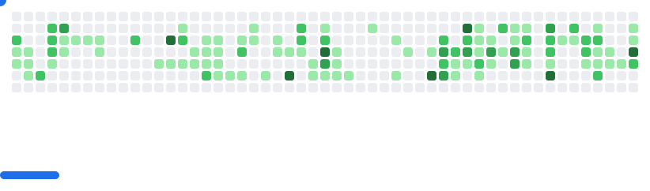

<picture>
  <source
    media="(prefers-color-scheme: dark)"
    srcset="images/breakout-dark.svg"
  />
  <source
    media="(prefers-color-scheme: light)"
    srcset="images/breakout-light.svg"
  />
  
</picture>

---

👋 Greetings Traveler!

```json
{
  "name": "Florian Kempe",
  "role": "Medior Software Developer",
  "skills": [
    "PHP", 
    "Dart", 
    "Docker",
    "Terraform"
  ],
  "interests": [
    "Backend development",
    "DevSecOps",
    "Process improvement"
  ],
  "contact": {
    "github": "https://github.com/ACodingPhoenix",
    "linkedin": "https://www.linkedin.com/in/floriankempe/"
  }
}
```

---

> "But we didn't ask you to make that..."
> 
> "Well I did it anyway"
